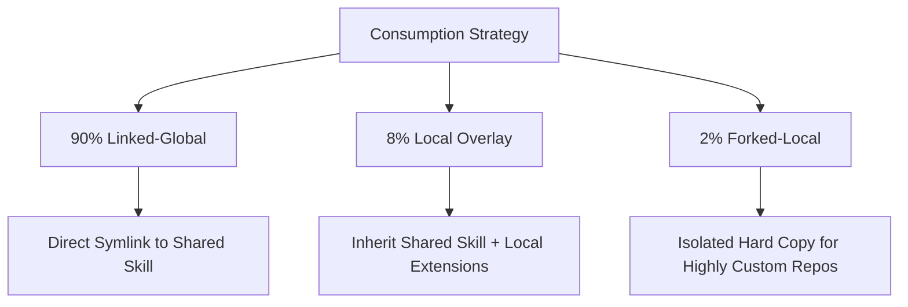

# agent-skills

> **The Single Source of Truth for Reusable Global AI Agent Skills.**

`agent-skills` is a lightweight, standardized repository for defining, versioning, and deploying AI agent skills across multiple developer workspaces. It is designed to be fully compatible with major agentic frameworks—including **Codex**, **Claude Code**, **Antigravity (Gemini)**, and **GitHub Copilot Agent-Style Project Skills**.

---

## 🌟 What is an AI Agent Skill?

An **AI Agent Skill** is a structured, high-signal set of instruction files, checklists, reference documents, and utility scripts that extend the capabilities of LLM-based autonomous coding agents. By providing standardized operating procedures (SOPs), we make agent behavior **reusable, reliable, and consistent** across different tasks and repositories.

---

## 🎯 Why This Repository Exists

1. **Avoid Duplicate Knowledge**: Prevent copy-pasting the same guidelines across dozens of work and personal repositories.
2. **Centralized Level-Up**: Improve agent behavior in one global place, and let all consumer repos benefit from those improvements.
3. **Guard Clean Codebases**: Keep repository-specific directories free from generic AI configuration clutter.
4. **Strict Safety & Quality**: Enforce rigorous, tested patterns for complex tasks like triaging, pull request reviews, and system handoffs.

---

## 📦 The 90/8/2 Consumption Model

To maintain a clean separation between **reusable global behaviors** and **repository-local rules**, we recommend the **90/8/2 Model**:



### 1. Linked-Global (90%)
*   **What**: The child repository points directly to a global skill folder using a local reference or symlink.
*   **Why**: Best for standard skills that should behave identically across all contexts (e.g., standard code reviews, triaging).
*   **Warning**: Editing a symlinked skill in your work repository *will* modify the global skill! Be mindful and make local-specific adjustments using Overlays.

### 2. Local Overlay (8%)
*   **What**: The child repository loads the global skill but layers a small, repo-specific configuration file (an *overlay*) on top of it.
*   **Why**: Adds context (e.g., project-specific frameworks, lint targets) while retaining the core global procedure.

### 3. Forked-Local (2%)
*   **What**: The child repository contains a hard copy of the skill that diverges permanently.
*   **Why**: Reserved for highly specialized environments with exceptional rules that make global alignment impossible.

---

## 🔌 Integration Paths & Tool Mapping

Agents look for skills in specific configuration directories. Below are the common paths to integrate `agent-skills` into your agentic environments:

| Tool | Global Path (Home Directory) | Local Path (Repository Root) |
| :--- | :--- | :--- |
| **Codex** | `~/.agents/skills/` | `<repo>/.agents/skills/` |
| **Claude Code** | `~/.claude/skills/` | `<repo>/.claude/skills/` |
| **Antigravity (Gemini)** | `~/.gemini/antigravity/skills/` | `<repo>/.agent/skills/` |
| **GitHub Copilot / Other** | `~/.config/copilot/skills/` | `<repo>/.github/skills/` |

### Quick Symlink Setup Example

To link a global skill directly to a local repository, create a directory symlink:

```bash
# Link the repo-triage skill into a local project
mkdir -p .agents/skills/
ln -s ~/repos/projects/agent-skills/skills/repo-triage .agents/skills/repo-triage
```

*For detailed strategies, see [docs/consuming-skills.md](file:///Users/pcoletsos/repos/projects/agent-skills/docs/consuming-skills.md).*

---

## 🛠 Starter Skills (v0.1.0)

This repository launches with six essential starter skills. Each skill begins at version `0.1.0` in a `draft` status:

1.  **[repo-triage](file:///Users/pcoletsos/repos/projects/agent-skills/skills/repo-triage/SKILL.md)**: Standard procedure for inspecting codebase layouts, identifying blockers, reading state, and prioritizing the next three high-impact actions.
2.  **[pr-review](file:///Users/pcoletsos/repos/projects/agent-skills/skills/pr-review/SKILL.md)**: Thorough code review checklist for assessing correctness, architectural alignment, test coverage, security risk, and documentation impact.
3.  **[architecture-review](file:///Users/pcoletsos/repos/projects/agent-skills/skills/architecture-review/SKILL.md)**: Structural review to check module coupling, dependency rules, boundaries, and tactical-vs-strategic designs.
4.  **[issue-planning](file:///Users/pcoletsos/repos/projects/agent-skills/skills/issue-planning/SKILL.md)**: Method to turn rough system goals into highly detailed milestones, clear GitHub issue descriptions, and precise acceptance criteria.
5.  **[agent-session-handoff](file:///Users/pcoletsos/repos/projects/agent-skills/skills/agent-session-handoff/SKILL.md)**: Guidelines for compiling an exact, zero-loss status summary of a workspace so that a subsequent agent can resume work instantly.
6.  **[tech-stack-visual](file:///Users/pcoletsos/repos/projects/agent-skills/skills/tech-stack-visual/SKILL.md)**: A methodology to inspect a codebase's tools and generate detailed prompts or code for architecture diagrams (Mermaid/PlantUML).

---

## 🚦 Governance & PR Policy

To ensure high reliability, global skills follow a strict development lifecycle:

*   **No Pollution**: Do not commit project-specific paths, corporate names, or proprietary technologies to global skills. Use overlays instead.
*   **Dedicated PRs**: Edits to files in `skills/` must be submitted via separate Pull Requests dedicated exclusively to skill updates. Never mix skill improvements with regular codebase feature work.
*   **Changelogs**: Every behavior change requires a corresponding version bump and an entry in the skill's local `CHANGELOG.md` file.

*Read the [AGENTS.md](file:///Users/pcoletsos/repos/projects/agent-skills/AGENTS.md) guide and the [docs/skill-change-policy.md](file:///Users/pcoletsos/repos/projects/agent-skills/docs/skill-change-policy.md) to understand full workflow compliance.*

---

## 📄 License

Distributed under the MIT License. See `LICENSE` for details.
