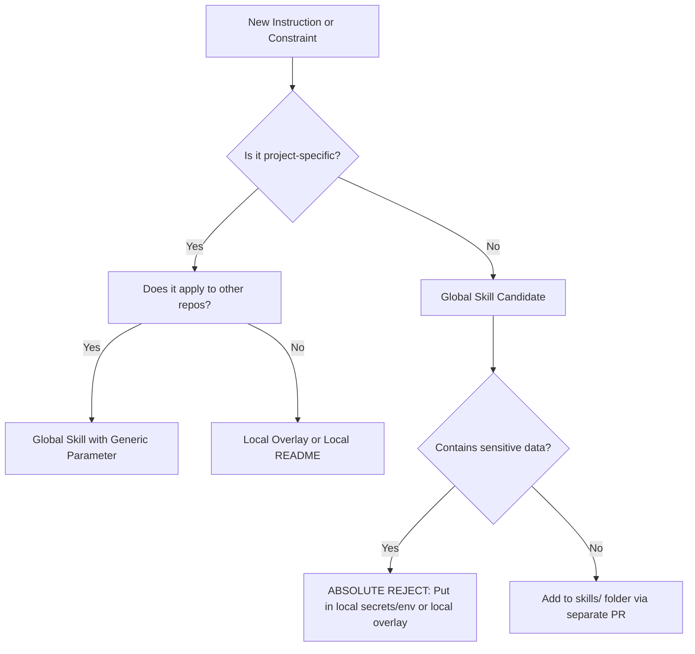

# Decision Matrix: Global Skills vs. Local Context

When pair-programming with AI agents, you will frequently want to add instructions to correct their mistakes or optimize their outputs. Deciding **where** to place these instructions is critical to keeping the global skills reusable while respecting local repository variance.

Use this decision matrix to guide your placement of new rules.

---

## 🗺 Quick Decision Flowchart

---

## 🔍 Detailed Comparison Table

| Dimension | Global Skill (`skills/`) | Local Overlay / Local README |
| :--- | :--- | :--- |
| **Scope** | Applies to all repositories of similar type. | Applies strictly to the current active repository. |
| **Data Flow** | High-signal procedures, logical flow, generic checklists. | Particular frameworks, file structures, lint targets, API ports. |
| **Sensitivity** | MIT Public/Private. Zero credentials or keys. | Can contain internal directories or corporate project markers. |
| **Edit Mechanism** | Central Pull Request in `agent-skills` repository. | Direct commit within the target project repository. |
| **Update Impact** | Compound upgrade: improves all projects at once. | Isolated fix: limits blast radius for experimental features. |

---

## 💡 Practical Examples

### Case A: "Ensure the agent runs code linters before committing."
*   **Verdict**: **Global Skill (pr-review)**.
*   **Why**: Running linters before committing code is a universal software quality best practice. The logic of checking quality belongs globally.
*   **Local Implementation**: The specific linter command (e.g., `npm run lint` vs. `ruff check` vs. `go fmt`) is loaded locally from the project's config or custom overlay.

### Case B: "In the Douka project, use the custom `douka-core` authentication module."
*   **Verdict**: **Local Overlay / Local `AGENTS.md`**.
*   **Why**: The `douka-core` module is highly specific to a single client/repository. Putting this in a global skill would pollute the agent's context in unrelated projects (e.g., VF or vrachnis), potentially causing the agent to hallucinate or attempt importing missing dependencies.

### Case C: "Create a visual architecture plan for our system."
*   **Verdict**: **Global Skill (tech-stack-visual)**.
*   **Why**: The procedure for inspecting files, identifying frameworks, and outputting clean Mermaid syntax is reusable.
*   **Local Implementation**: The resulting diagram code is saved in the local repository's `docs/` folder.

---

## 🚦 Rule of Thumb: The "Clean Sandbox" Test
Before committing an instruction to a global skill in `agent-skills`, ask yourself:
> *"If I spun up an empty repository running a completely different language stack (e.g. switching from Next.js/React to Go/Rust), would this instruction still be correct and helpful to the agent?"*

If the answer is **no**, do not add it to the global skill. Write a local repository overlay or add it to the project's local `AGENTS.md`.
