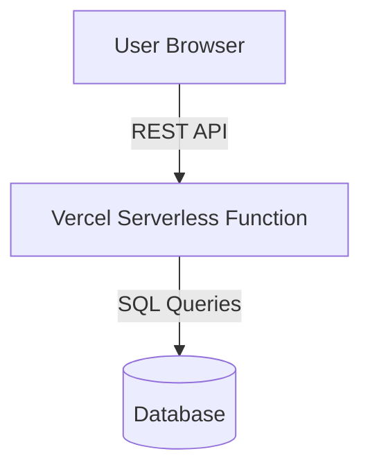

# Tech Stack Visual Skill

## Purpose
Examine a codebase to identify confirmed software components, runtime environments, deployment layers, and data paths, converting this knowledge into high-signal instructions or directly into code-based diagrams (e.g. Mermaid, PlantUML).

## Use When
- Asked to "Draw the architecture," "Make a diagram," or "Write a Mermaid visual."
- Creating system walkthroughs, onboarding documents, or architectural philosophy guides.
- You need to visualize complex data mappings or module boundaries.

## Do Not Use When
- Writing simple text-only explanations of technology choices.
- Doing code-level PR checks (use `pr-review`).

## Inputs To Check
- Lockfiles and configurations: `package.json`, `Cargo.toml`, `go.mod`, `docker-compose.yml`.
- Deployment pipelines: `.github/workflows/`, `vercel.json`, `fly.toml`.
- Schema files and database contracts.

## Procedure
1.  **Inspect Structure**: Map directory layers to understand core entry points, data flows, and infrastructure limits.
2.  **Identify Confirmed Technologies Only**: Audit configuration files to compile a list of active frameworks, libraries, databases, and deployment runtimes.
3.  **Map Runtime & Deployment Layers**: Identify where the application runs (e.g. browser, serverless Vercel function, local Docker runtime, native mobile sandbox).
4.  **Trace Data Flow**: Document how data traverses the system (e.g., from the client browser -> serverless route -> database API -> third-party webhooks).
5.  **Generate Mermaid or PlantUML**:
    *   Construct visual flowcharts or sequence diagrams using crisp, error-free Mermaid or PlantUML code.
    *   Ensure all node names containing brackets, parentheses, or unique characters are safely quoted (e.g. `node["Label (Extra Info)"]`).
    *   Avoid using HTML tags inside Mermaid labels.
6.  **Create a Visual Prompt**: If complex external graphic design is required, compile an extremely descriptive, contextual text prompt that the user can feed into high-end image generators (e.g., Midjourney, DALL-E) or diagram tools (e.g., Eraser.io, Miro).

## Output Format
Render a clean Markdown visual design pack:
```markdown
# Architectural Visual Design Pack

## 🛠 Tech Stack Snapshot
- **Core Framework**: ...
- **Data Layer**: ...
- **Deployment & Hosting**: ...

## 📊 Live Flowchart (Mermaid)


## 🎨 Creative Graphic Prompt
> **Diagram Style**: Flat, modern, dark-mode technical schematic...
> **Elements**: ...
```

## Rules
- **NEVER invent or assume technologies.** Only diagram modules, services, databases, or deployment environments that are explicitly verified in the project's source code or documentation.
- Ensure all Mermaid diagrams are syntactically valid. Never leave open-ended brackets or unquoted special characters in node definitions.

## Global Skill Change Policy
This is a shared, global skill. Do NOT add repo-specific details or credentials. Any modifications to this skill's behavior must be performed in a dedicated Pull Request within the `agent-skills` repository, requiring a version bump and an entry in `CHANGELOG.md`.
